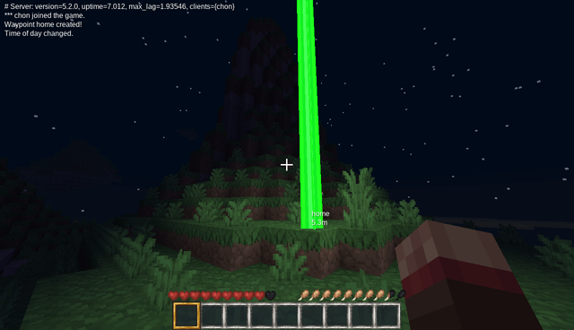
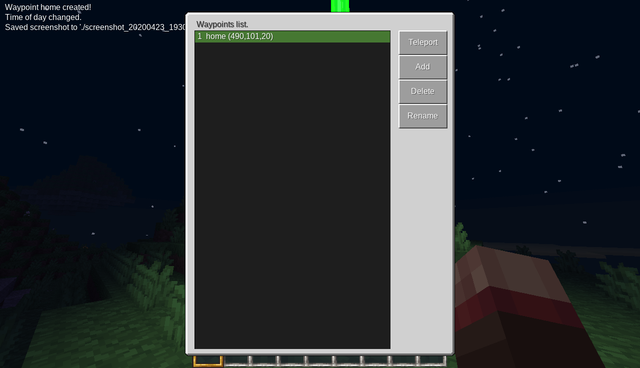

# Simple Waypoints

A minetest 5.2.0+ mod that lets you set waypoints/beacons at current position.

 

#### How it works
This mod offers two ways to manage your waypoints: a text-based interface using chat commands and a graphical user interface (GUI). Choose the method that you find most convenient.

TEXT INTERFACE:

- **Create Waypoint:** `/wc <waypoint name>`
- **Delete Waypoint:** `/wd <waypoint name>`
- **Teleport to Waypoint:** `/wt <waypoint name>`
- **List Waypoints:** `/wl`

GUI:
- **Use menu:** `/wf`

NOTE 1:

The GUI allows you to select a beacon color from 8 available options. When creating waypoints using the chat commands, a random color will be selected for the beacon.

**UPDATE:** Beacons are disabled by default but you can enable them in the minetest config.

NOTE 2: "teleport" privilege is required.

Works with Minetest 5.2.0+

#### Installation

Extract zip to the mods folder.
